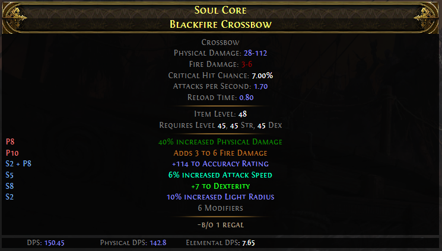
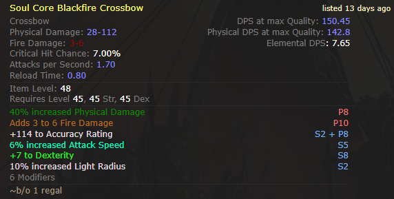

# User style for trade 2

Adds different highlighting to mods on the trade 2 site

- [User style for trade 2](#user-style-for-trade-2)
  - [Install](#install)
  - [Styles](#styles)
    - [Raw Tag Based](#raw-tag-based)
    - [Raw Tag Based, compact only](#raw-tag-based-compact-only)

## Install

Given you have [stylus](https://github.com/openstyles/stylus) or some other userstyle manager (or if you do it manually),

1. Find which style you want to install
2. Click to go to that file
3. Click "Raw" in the top right
  a. This should open in with your userstyle manager, just hit save there

or use the install links below

## Styles

### Raw Tag Based

[Install](https://github.com/Kvan7/gist-trade-highlight/raw/refs/heads/main/tagOnly.user.css)

Very rudimentary, just strictly takes the tags on the mods and adds different colors to different tags. The only changes
to strictly the in game tags are adding different colors to str, dex, and int, not showing bleeding as physical, and making
+levels without the "gem" tag display as +levels with the "gem" tag.

### Raw Tag Based, compact only

[Install](https://github.com/Kvan7/gist-trade-highlight/raw/refs/heads/main/tagOnlyCompact.user.css)

Same as above, but doesn't change the "default" view, only the compact one(which had a small amount of highlighting before)

