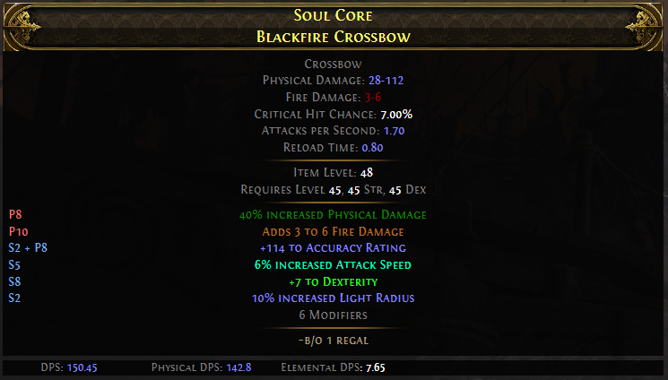
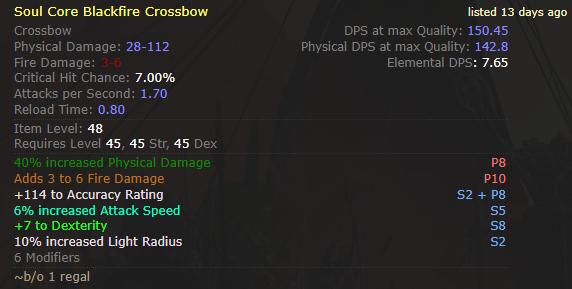

# User style for trade 2

Adds different highlighting to mods on the trade 2 site

- [User style for trade 2](#user-style-for-trade-2)
  - [Install](#install)
  - [Styles](#styles)
    - [Raw Tag Based](#raw-tag-based)
    - [Raw Tag Based, compact only](#raw-tag-based-compact-only)
    - [Opinionated CSS](#opinionated-css)

## Install

Given you have [stylus](https://github.com/openstyles/stylus) or some other userstyle manager (or if you do it manually),

1. Find which style you want to install
2. Click to go to that file
3. Click "Raw" in the top right
  a. This should open in with your userstyle manager, just hit save there

or use the install links below

## Styles

### Raw Tag Based

Very rudimentary, just strictly takes the tags on the mods and adds different colors to different tags. The only changes
to strictly the in game tags are adding different colors to str, dex, and int, and making
+levels without the "gem" tag display as +levels with the "gem" tag.

### Raw Tag Based, compact only

Same as above, but doesn't change the "default" view, only the compact one(which had a small amount of highlighting before)

### Opinionated CSS

This one is one that I use so have customized it a bit more, like highlighting fractured mods better, and fully hiding bonded mods.
Also will be most actively updated since I use it.

NOTE: ***Hides "Bonded: *" rune modifiers***

(I should really make it hide minion mods too. . . . )
